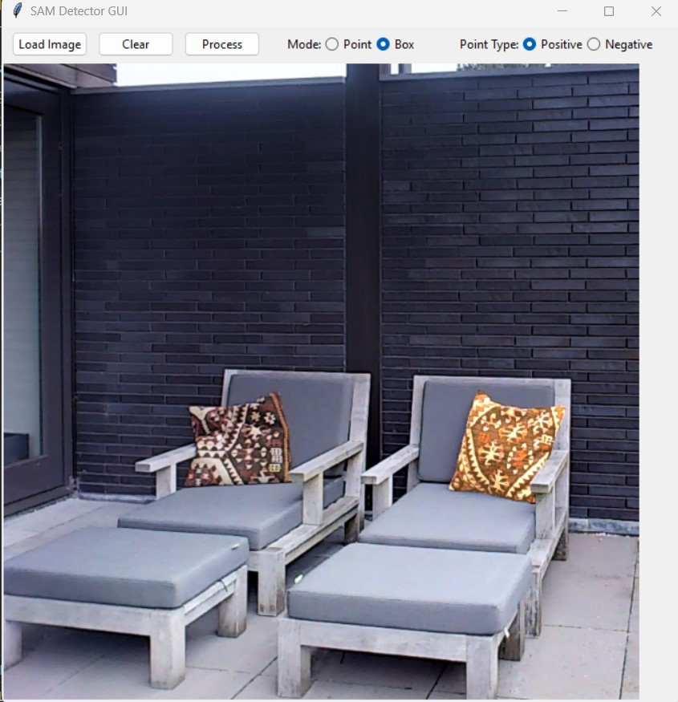

# 2D to 3D Scene Reconstruction Project

## Project Overview
This project aims to reconstruct 3D scenes from 2D images through a multi-stage pipeline approach. Given the complexity of direct 2D to 3D reconstruction, we break down the challenge into manageable components, leveraging state-of-the-art models for each stage.

## Pipeline Stages
1. **Object Detection**: Identify and localize objects in 2D images
2. **Instance Segmentation**: Generate precise masks for detected objects
3. **2D to 3D Reconstruction**: Convert segmented objects into 3D representations

## Current Progress

### Implemented Features
- GUI-based segmentation tool using SAM2 (Segment Anything Model 2)
  - Support for both point and box prompts
  - Interactive visualization
  - Mask extraction and saving
  - Real-time preview of segmentation results

<!-- Project Screenshot -->
<p align="center">
  
</p>

### Current Working Tools
- `maskGUI.py`: Interactive GUI application for image segmentation
  - Loading and displaying images
  - Multiple prompt types (points/boxes)
  - Visualization of segmentation results
  - Export of individual object masks

## TODO & Future Exploration

### Object Detection
- [ ] Evaluate different object detection approaches:
  - YOLO family (v5, v8, etc.)
  - Faster R-CNN
  - RetinaNet
  - DETR variants
- [ ] Explore traditional CV approaches:
  - Contour detection (cv2.findContours)
  - Edge detection methods
  - Region proposal techniques

### Segmentation
- [ ] Compare various segmentation models:
  - SAM2 variants (base, large)
  - Mask R-CNN
  - YOLACT
  - OneFormer
  - Mask2Former
- [ ] Evaluate segmentation quality metrics
- [ ] Optimize processing speed

### 2D to 3D Conversion
- [ ] Research and evaluate 2D to 3D models:
  - Hunyan3d
  - Instant NGP
  - NeRF variants
  - Point-E
  - GET3D
- [ ] Local deployment strategies
- [ ] Performance optimization

## Installation

```bash
# Clone the repository
git clone [repository-url]

# Install dependencies
pip install -r requirements.txt

# Run the segmentation GUI
python segment_gui.py
```

## Dependencies
- Python 3.8+
- PyTorch
- Ultralytics
- OpenCV
- tkinter
- NumPy
- Pillow

## Usage

### Segmentation GUI
1. Launch the application:
   ```bash
   python segment_gui.py
   ```
2. Load an image using the "Load Image" button
3. Select interaction mode (point/box)
4. Add prompts by clicking/dragging on the image
5. Click "Process" to generate segmentation
6. Results will be saved in the "segments" directory

## Project Structure
```
.
├── README.md
├── segment_gui.py        # Main GUI application
├── requirements.txt      # Project dependencies
├── models/              # Model weights and configurations
└── output/              # Default output directory
    └── segments/        # Segmentation results
```

## Acknowledgements
- SAM2 by Meta AI
- HumanNeRF
- Ultralytics YOLO